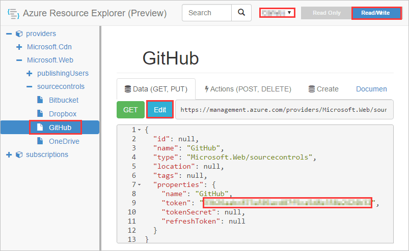

# LoB solution with ASE

**Table of content**

[Create App Registrations in AAD](#create-app-registrations-in-aad)

* [Get Tenant Id](#get-tenant-id)
* [Create App Registration for the Admin Web App](#create-app-registration-for-the-admin-web-app)

[Deploy Azure Components with ARM Template](#deploy-azure-components-with-arm-template)

* [GitHub Authorize](#github-authorize)
* [Deploy Azure Components](#deploy-azure-components)
* [Deployment output](#deployment-output)

* [Add Reply URL to the Admin Web App](#add-reply-url-to-the-admin-web-app)

## Architecture

## Create App Registrations in AAD 

### Get Tenant Id

Open the AAD in Azure Portal, then get the **Directory ID**.

The **Directory ID** will be used as the value of  **Azure Ad Tenant Id** parameter of the ARM Template.

### Create App Registration for the Admin Web App

Create a new App Registration in the AAD:

* Name: LoB with ASE - Admin

* Application Type: Web app/API

* Sign-on URL: https://lob-with-ase/admin

* Permissions:

   | API                            | Permission Type | Permissions                   |
   | ------------------------------ | --------------- | ----------------------------- |
   | Windows Azure Active Directory | Delegated       | Sign in and read user profile |

Copy aside its **Application Id**. It will be used as the values of **Azure Ad Client Id** parameter of the ARM Template.

## Deploy Azure Components with ARM Template

### GitHub Authorize

1. Generate Token

   - Open [https://github.com/settings/tokens](https://github.com/settings/tokens) in your web browser.

   - Sign into your GitHub account where you forked this repository.

   - Click **Generate Token**.

   - Enter a value in the **Token description** text box.

   - Select the following s (your selections should match the screenshot below):

     - repo (all) -> repo:status, repo_deployment, public_repo
     - admin:repo_hook -> read:repo_hook

     

   - Click **Generate token**.

   - Copy the token.

2. Add the GitHub Token to Azure in the Azure Resource Explorer

   - Open [https://resources.azure.com/providers/Microsoft.Web/sourcecontrols/GitHub](https://resources.azure.com/providers/Microsoft.Web/sourcecontrols/GitHub) in your web browser.

   - Log in with your Azure account.

   - Selected the correct Azure subscription.

   - Select **Read/Write** mode.

   - Click **Edit**.

   - Paste the token into the **token parameter**.

     

   - Click **PUT**.

### Deploy Azure Components

1. Fork this repository to your GitHub account.

2. Click the Deploy to Azure Button:

   

3. Fill in the values on the deployment page:

   **Basics**:

   * **Subscription**: choose one of your subscriptions.
   * **Resource group**: please do create a new resource group.
   * **Location**:  select a location.

   **Settings**:

   * **Ase Name**: the name of the App Service Environment. 

     >  Note:  It is also used to name other azure resources. To avoid naming conflict, please choose a special name, for example: **tyler-eshop-180308**.

   * **Ase Location**: please do choose the same location as location of the resource group.

     > Note: This parameter was added because of this [issue](https://github.com/Azure/azure-quickstart-templates/issues/2828).

   * **Sql Server Administrator Login**:  please keep the default value.

     > Note: If you want to change it, please make sure your login name meets the following requirements - It's a SQL Identifier, and not a typical system name (like admin, administrator, sa, root, dbmanager, loginmanager, etc.), or a built-in database user or role (like dbo, guest, public, etc.). Make sure your name doesn't contain whitespaces, unicode characters, or nonalphabetic characters, and that it doesn't begin with numbers or symbols.

   * **Sql Server Administrator Login Password**: please do use a strong password.

     > Note:
     >
     > - Your password must be at least 8 characters in length.
     > - Your password must contain characters from three of the following categories – English uppercase letters, English lowercase letters, numbers (0-9), and non-alphanumeric characters (!, $, #, %, etc.)

   * **Azure Ad Tenant Id**/**Client Id**: use the values you got from previous chapter.

     > Note: they are used for authentication of the Admin Web App.

   * **Source Code Repository URL**:  use the URL of the repository you just created -`https://github.com/<YourAccount>/MS-Azure-LOB-ASE`

   * **Source Code Branch**: master

   * **Source code Manual Integration**: false

   **Terms and conditions**:

   * Check **I agree to the terms and conditions stated above**.

4. Click **Purchase**.

### Deployment output

After the deployment finishes, you will get some important information from the outputs section.

* Web App URL
* Admin App URL

> Note: the deployment window above could be re-open in the **Deployments** tab of the resource group.
>
> 

### Add Reply URL to the Admin Web App

1. Get the URL of the Admin Web app, and change the schema to http**s**, we will get a base URL.

    

    For example: `https://huddle-bot.azurewebsites.net`

2. Append `/signin-oidc` to the base URL, we will get the replay URL. 

   For example: `https://dev-eshop-admin.dev-eshop.p.azurewebsites.net/signin-oidc`

3. Add it the Bot App Registration and save.

   

**Copyright (c) 2018 Microsoft. All rights reserved.**